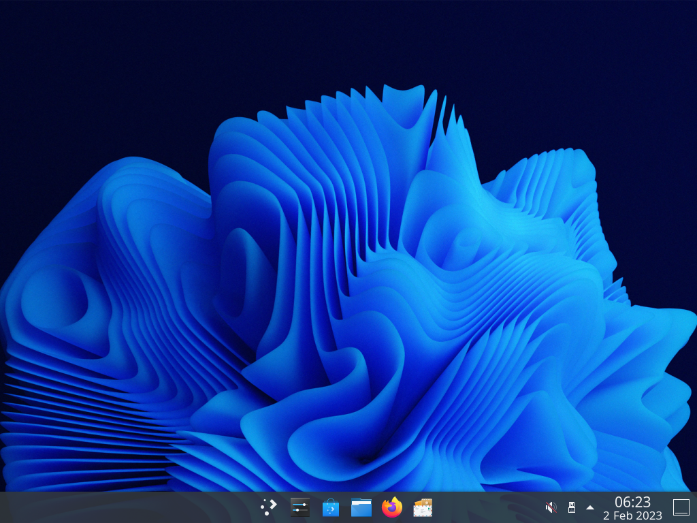

# xi



## xiiso

### Download

[xi.iso](https://www.dropbox.com/s/ro9m4bdk7k8drk4/xi.iso?dl=1)

### Flash

```sh
sudo cp xi.iso DISK
```

### Install

```sh
xibootstrap DISK ADMIN
```

### Build

```sh
sudo xargs -a xiiso.devdeps apt install -y
make
```

### Run

```sh
./run.sh
```
